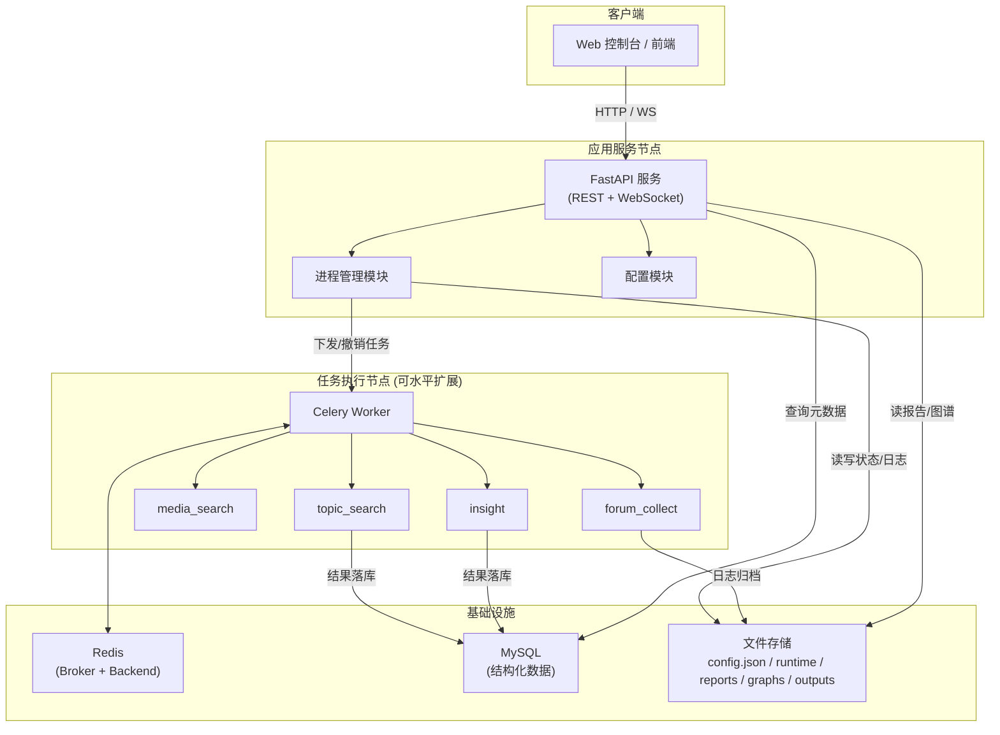
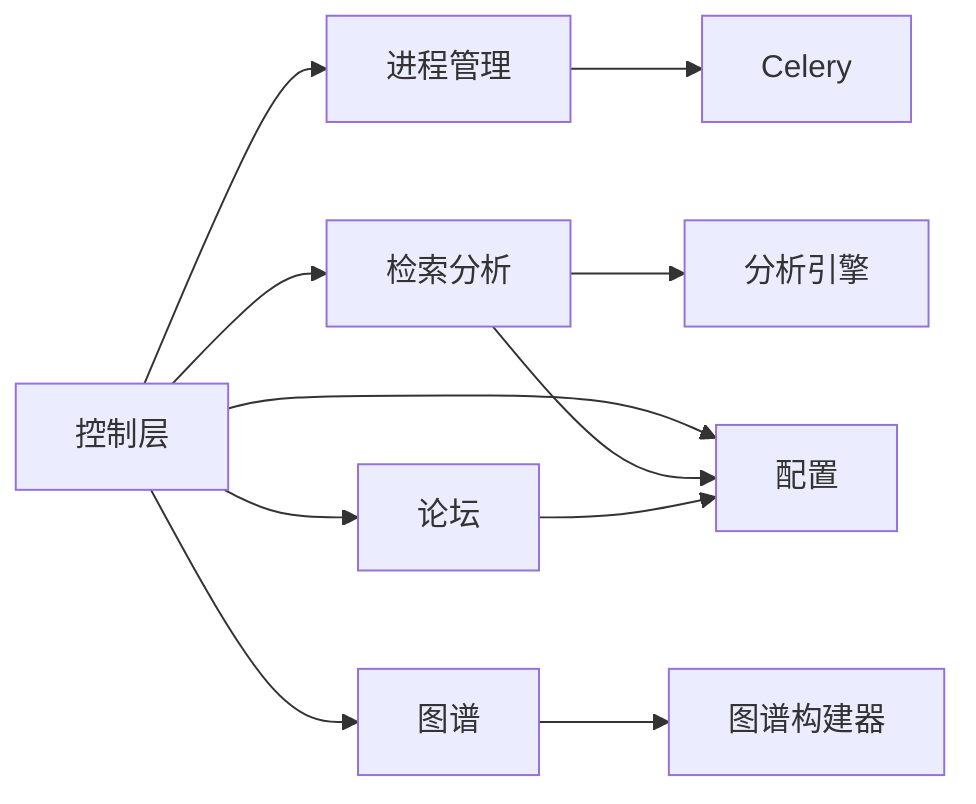
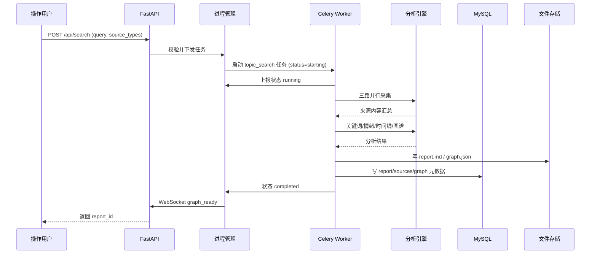
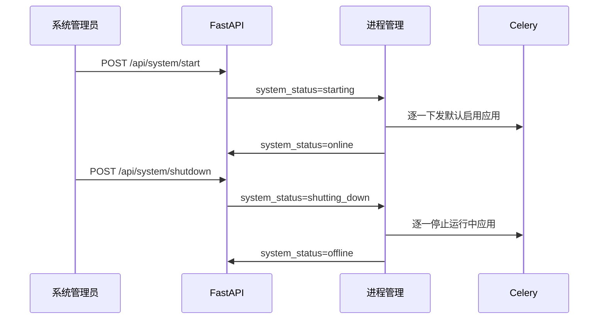
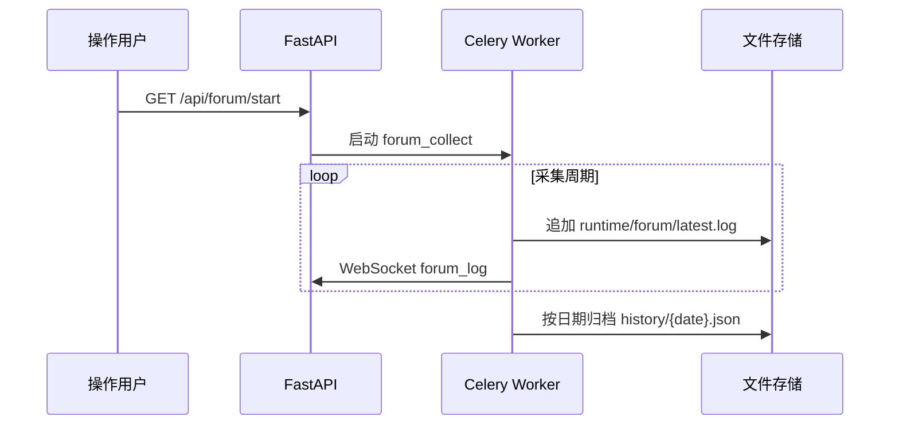
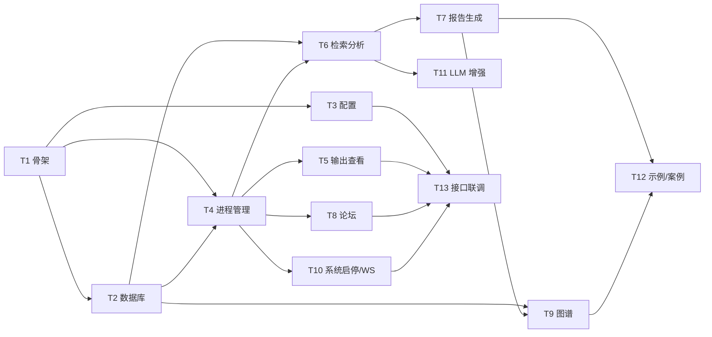

# 舆情分析平台 · 技术开发文档

> 文档版本：v1.1
> 文档状态：已评审，可指导开发
> 适用范围：后端开发阶段（前端暂缓，接口与数据契约先行冻结）

---

## 1. 文档概述

### 1.1 背景

面向指定主题的舆情分析需求，需要一套可运行、可演示的舆情分析平台，从「公开信息、多媒体内容、内部沉淀数据」三个方向并行采集信息，经分析处理后生成结构化舆情报告，并提供可视化图谱用于关系追溯。

### 1.2 目标

- 交付可运行的 Web 控制台、分析服务、配置文件、示例数据、接口说明与至少一个完整主题分析案例。
- 提供单功能应用（主题检索、多媒体检索、论坛采集、洞察分析、报告生成、图谱查询）的独立启停、状态监控、输出查看能力。
- 保证无外部付费依赖下即可离线跑通全流程验收，同时预留大模型增强能力。

### 1.3 范围

**本期范围（后端）**：

- 控制层：Web 路由、状态接口、系统启停入口。
- 进程管理：单功能应用启动、停止、状态采集、输出采集。
- 检索分析：主题检索、内容分析、洞察生成、报告汇总。
- 论坛采集：任务控制、日志输出、历史记录保存。
- 图谱：图谱结果加载、指定报告查询、关系检索。
- 配置：配置读取、保存、运行参数热更新。

**本期不包含（前端）**：

- 控制台/检索/论坛/图谱/配置/系统状态等页面 UI 实现。
- 前端模块（控制台、输出、论坛、图谱、检索、配置）代码开发。

> 前端开发阶段仅需遵循本文档第 6 节冻结的接口与数据契约，无需改动后端。

---

## 2. 总体架构设计

### 2.1 业务架构

系统划分为「接入层、任务层、能力层、存储层」四层：

- **接入层**：FastAPI 提供 REST 接口与 WebSocket 实时消息，承载控制台与第三方调用。
- **任务层**：Celery 异步任务队列，以独立 Task 承载每个单功能应用，实现启停与状态管理。
- **能力层**：检索分析引擎（规则 + 可插拔 LLM）、图谱构建器、报告汇总器、论坛采集器。
- **存储层**：MySQL 存结构化索引数据，JSON/Markdown 文件存配置、日志、报告、图谱、输出。

### 2.2 系统拓扑 / 部署图



**节点说明**：

| 节点 | 职责 | 扩展性 |
|------|------|--------|
| 应用服务节点 | 路由、状态聚合、配置管理 | 无状态，可多实例（需共享 Redis/MySQL/文件存储） |
| 任务执行节点 | 执行采集/分析类任务 | 水平扩展，按队列拆分 |
| Redis | 消息代理 + 结果后端 | 单机起步，生产主从 |
| MySQL | 结构化索引数据 | 单机起步，生产主从/分库 |
| 文件存储 | 大对象（报告/图谱/日志） | 建议挂载共享卷或对象存储 |

---

## 3. 技术栈选型与版本

| 组件 | 版本 | 选型理由 |
|------|------|----------|
| Python | 3.11 | 稳定 LTS 生态，asyncio 与类型注解成熟 |
| FastAPI | 0.115.x | 原生 async、自动 OpenAPI、Pydantic 校验，契合异步任务系统 |
| Uvicorn | 0.30.x | ASGI 服务器，支持 WebSocket，生产可用 |
| Celery | 5.4.x | 成熟分布式任务队列，天然支持任务启停/撤销/状态查询，契合「单功能应用」模型 |
| Redis | 7.x | Celery broker/backend，支撑状态与结果存储 |
| SQLAlchemy | 2.0.x | 成熟 ORM，2.0 异步与类型支持完善 |
| PyMySQL | 1.1.x | MySQL 纯 Python 驱动 |
| Pydantic | 2.x | 数据校验与模型序列化，与 FastAPI 深度集成 |
| pydantic-settings | 2.x | 环境变量/配置文件管理 |
| websockets | 12.x | WebSocket 实时消息推送 |
| cryptography | 42.x | 密码/密钥相关加密（预留） |

**分析引擎选型（由架构方确定）**：采用「内置规则模板引擎（默认）+ 可插拔 LLM 适配层（可选）」双模式。

- 规则模式：关键词抽取、情感词典判定、时间线构建、图谱生成，离线可运行，保证验收确定性。
- LLM 模式：通过统一 `LLMClient` 接口接入大模型 API，实现洞察/聚类/报告润色；未配置密钥自动回退规则模式。

---

## 4. 模块/功能拆解

按业务域划分六大模块，对应需求 2.2.6：

### 4.1 控制层模块（app/api）

- 职责：Web 路由、页面渲染（前端阶段）、状态接口、系统启停入口。
- 边界：不包含业务逻辑，仅做参数校验、鉴权、调用 Service 并组装响应。

### 4.2 进程管理模块（process_manager）

- 职责：单功能应用启动、停止、状态采集、输出采集。
- 应用清单：`topic_search`、`media_search`、`forum_collect`、`insight`、`report`、`graph`。
- 状态机（应用）：`stopped → starting → running → stopping → failed`。
- 停止语义：停止后不再接收新任务；已生成输出与日志保留。

### 4.3 检索分析模块（search_service + analysis）

- 职责：主题检索、内容分析、洞察生成、报告汇总。
- 采集规则：每次检索至少保存主题词、执行时间、来源摘要、分析输出。
- 来源类型：`news`、`image`、`video`、`forum_post`、`internal_data`。

### 4.4 论坛模块（forum_service）

- 职责：论坛采集任务控制、日志输出、历史记录保存。
- 状态机（论坛）：`idle → running → stopped → failed`。
- 日志：实时写 `runtime/forum/latest.log`，按日期归档 `history/{date}.json`。

### 4.5 图谱模块（graph_service + graph_builder）

- 职责：图谱结果加载、指定报告查询、关系检索。
- 节点最小字段：节点标识、节点类型、关系类型、来源引用。

### 4.6 配置模块（config_service）

- 职责：配置读取、保存、运行参数热更新。
- 配置载体：`config.json`（系统配置、运行参数、默认应用开关）。

**模块依赖关系**：



---

## 5. 数据库设计

### 5.1 存储策略

采用「MySQL 存索引/元数据 + 文件存大对象」的混合策略：

- MySQL：任务、来源、报告元数据、图谱节点/边、论坛日志（可查询）。
- 文件：`config.json`、`runtime/**`、`reports/*/report.md`、`graphs/*/graph.json`、`outputs/*/latest.txt`。

> 双写一致性：任务完成时先写文件（生成 report.md / graph.json），成功后再更新 MySQL 元数据；MySQL 更新失败仅影响索引，不影响文件产物可访问性（降级可接受）。

### 5.2 ER 关系简述

```
search_tasks (1) ──< sources (N)
search_tasks (1) ──< reports (1)   [report 与 task 一一对应]
reports (1) ──< graph_nodes (N)
reports (1) ──< graph_edges (N)
forum_logs 独立实体
```

### 5.3 核心表结构

```sql
-- 检索任务
CREATE TABLE search_tasks (
  id            BIGINT UNSIGNED AUTO_INCREMENT PRIMARY KEY,
  task_id       VARCHAR(64)  NOT NULL UNIQUE,
  query         VARCHAR(255) NOT NULL,
  source_types  JSON         NOT NULL,
  status        VARCHAR(32)  NOT NULL DEFAULT 'stopped',
  report_id     VARCHAR(64)  NULL,
  error_msg     TEXT         NULL,
  created_at    DATETIME(3)  NOT NULL DEFAULT CURRENT_TIMESTAMP(3),
  updated_at    DATETIME(3)  NOT NULL DEFAULT CURRENT_TIMESTAMP(3) ON UPDATE CURRENT_TIMESTAMP(3),
  KEY idx_status (status),
  KEY idx_query (query),
  KEY idx_created (created_at)
) ENGINE=InnoDB DEFAULT CHARSET=utf8mb4;

-- 来源记录
CREATE TABLE sources (
  id            BIGINT UNSIGNED AUTO_INCREMENT PRIMARY KEY,
  task_id       VARCHAR(64)  NOT NULL,
  source_type   VARCHAR(32)  NOT NULL,          -- news/image/video/forum_post/internal_data
  title         VARCHAR(512) NOT NULL,
  url           VARCHAR(1024) NULL,
  summary       TEXT         NULL,
  published_at  DATETIME(3)  NULL,
  created_at    DATETIME(3)  NOT NULL DEFAULT CURRENT_TIMESTAMP(3),
  KEY idx_task_type (task_id, source_type),
  KEY idx_type (source_type)
) ENGINE=InnoDB DEFAULT CHARSET=utf8mb4;

-- 报告元数据
CREATE TABLE reports (
  id            BIGINT UNSIGNED AUTO_INCREMENT PRIMARY KEY,
  report_id     VARCHAR(64)  NOT NULL UNIQUE,
  topic         VARCHAR(255) NOT NULL,
  file_path     VARCHAR(512) NOT NULL,
  created_at    DATETIME(3)  NOT NULL DEFAULT CURRENT_TIMESTAMP(3),
  KEY idx_topic (topic),
  KEY idx_created (created_at)
) ENGINE=InnoDB DEFAULT CHARSET=utf8mb4;

-- 图谱节点
CREATE TABLE graph_nodes (
  id            BIGINT UNSIGNED AUTO_INCREMENT PRIMARY KEY,
  report_id     VARCHAR(64)  NOT NULL,
  node_id       VARCHAR(64)  NOT NULL,
  node_type     VARCHAR(32)  NOT NULL,
  label         VARCHAR(255) NOT NULL,
  ref           VARCHAR(1024) NULL,
  KEY idx_report (report_id),
  UNIQUE KEY uk_report_node (report_id, node_id)
) ENGINE=InnoDB DEFAULT CHARSET=utf8mb4;

-- 图谱边
CREATE TABLE graph_edges (
  id            BIGINT UNSIGNED AUTO_INCREMENT PRIMARY KEY,
  report_id     VARCHAR(64)  NOT NULL,
  source        VARCHAR(64)  NOT NULL,
  target        VARCHAR(64)  NOT NULL,
  relation_type VARCHAR(32)  NOT NULL,
  ref           VARCHAR(1024) NULL,
  KEY idx_report (report_id),
  KEY idx_src_tgt (source, target)
) ENGINE=InnoDB DEFAULT CHARSET=utf8mb4;

-- 论坛日志
CREATE TABLE forum_logs (
  id            BIGINT UNSIGNED AUTO_INCREMENT PRIMARY KEY,
  ts            DATETIME(3)  NOT NULL,
  event_type    VARCHAR(32)  NOT NULL,
  message       TEXT         NOT NULL,
  task_status   VARCHAR(32)  NOT NULL,
  KEY idx_ts (ts),
  KEY idx_task_status (task_status)
) ENGINE=InnoDB DEFAULT CHARSET=utf8mb4;
```

### 5.4 索引策略

- 高频过滤字段建索引：`status`、`source_type`、`topic`、`report_id`、时间字段。
- 图谱节点/边对 `report_id` 建联合索引，支撑按报告回查。
- 论坛日志按 `ts` 建索引，支撑按日期范围查询。
- 避免对大文本字段（`summary`、`message`）建索引。

### 5.5 数据迁移方案

- 使用 Alembic 管理 schema 版本，`alembic upgrade head` 一键迁移。
- 每张表使用 `utf8mb4` 字符集，`InnoDB` 引擎。
- 初始化迁移脚本含建表 + 基础索引，后续变更以增量迁移脚本形式提交。

---

## 6. 接口设计

### 6.1 通用约定

- 基础路径：`/api`
- 请求/响应均为 JSON（`Content-Type: application/json`）。
- 时间格式：ISO 8601（`YYYY-MM-DDTHH:mm:ss.sssZ`）。

### 6.2 统一响应格式

```json
{
  "code": 0,
  "message": "success",
  "data": {}
}
```

### 6.3 错误码枚举

| code | 含义 | HTTP 状态 |
|------|------|-----------|
| 0 | 成功 | 200 |
| 1001 | 参数校验失败 | 400 |
| 1002 | 资源不存在 | 404 |
| 2001 | 应用状态不允许该操作 | 409 |
| 2002 | 应用启停失败 | 500 |
| 3001 | 配置读写失败 | 500 |
| 3002 | 数据库异常 | 500 |
| 4001 | 任务执行失败 | 500 |
| 5001 | 系统内部错误 | 500 |

### 6.4 接口清单（对应需求 2.2.9）

| 方法 | 路径 | 请求 | 响应 data |
|------|------|------|-----------|
| GET | `/api/status` | - | 各应用状态列表 |
| GET | `/api/start/{app_name}` | - | 启动结果 |
| GET | `/api/stop/{app_name}` | - | 停止结果 |
| GET | `/api/output/{app_name}` | - | 最近输出文本 |
| GET | `/api/test_log/{app_name}` | - | 测试日志 |
| POST | `/api/search` | `query`, `source_types` | 检索与分析结果 |
| GET | `/api/forum/start` | - | 启动结果 |
| GET | `/api/forum/stop` | - | 停止结果 |
| GET | `/api/forum/log` | - | 最新日志 |
| POST | `/api/forum/log/history` | `date` | 历史日志 |
| GET | `/api/config` | - | 系统配置 |
| POST | `/api/config` | 配置对象 | 更新结果 |
| GET | `/api/system/status` | - | 整体服务状态 |
| POST | `/api/system/start` | - | 启动结果 |
| POST | `/api/system/shutdown` | - | 关闭结果 |
| GET | `/api/graph/latest` | - | 最新图谱 |
| GET | `/api/graph/{report_id}` | - | 指定报告图谱 |
| POST | `/api/graph/query` | 节点/关系条件 | 查询结果 |

### 6.5 请求/响应示例

**POST /api/search**

```json
// 请求
{ "query": "某品牌新品发布", "source_types": ["news", "forum_post"] }

// 响应
{
  "code": 0,
  "message": "success",
  "data": {
    "task_id": "tsk_20260826_001",
    "report_id": "rpt_20260826_001",
    "status": "running"
  }
}
```

**POST /api/graph/query**

```json
// 请求
{ "report_id": "rpt_20260826_001", "node_id": "n_001", "relation_type": "mention" }

// 响应
{
  "code": 0,
  "message": "success",
  "data": { "nodes": [], "edges": [] }
}
```

### 6.6 幂等性处理方案

- **启停类接口**：状态机守护，重复启动 `running` 应用返回 `2001`（状态不允许），不会重复下发任务；重复停止已停止应用直接返回成功（幂等）。
- **配置更新**：以「全量覆盖 + 版本号」提交，客户端携带 `version`，服务端比对，避免并发覆盖（乐观锁）。
- **检索任务**：以 `task_id` 为幂等键，重复提交返回已有任务而非新建。
- **论坛日志归档**：按 `date` 归档，同一天重复写入采用覆盖合并，保证幂等。

### 6.7 WebSocket 实时消息（对应 2.2.10）

| 类型 | 字段 |
|------|------|
| `app_status` | app_name, status |
| `app_output` | app_name, output_text |
| `forum_log` | message_text, task_status |
| `system_status` | system_status, running_apps |
| `graph_ready` | report_id, graph_path |
| `error` | module_name, error_message |

---

## 7. 核心业务流程时序图

### 7.1 主题检索完整流程



### 7.2 系统启停流程



### 7.3 论坛采集日志流程



---

## 8. 非功能性需求实现

### 8.1 性能指标

| 指标 | 目标值 | 说明 |
|------|--------|------|
| 状态/配置查询接口 | TPS ≥ 200 | 纯读接口，加缓存 |
| 检索任务下发 | TPS ≥ 50 | 异步化，同步仅落库 |
| 任务执行 | 单主题 ≤ 60s | 三路采集并行 |
| 文件读取（报告/图谱） | P95 ≤ 200ms | 小文件，直接读 |

### 8.2 缓存策略

- Redis 缓存：应用状态、系统状态（TTL 5s，变更即失效）。
- 配置缓存：进程内缓存 + 变更广播失效。
- 报告/图谱文件：以 `report_id` 为键缓存解析结果（TTL 10min）。

### 8.3 日志埋点

- 结构化日志（JSON），字段：`ts`、`level`、`module`、`task_id`、`message`、`extra`。
- 埋点范围：接口入口/出口、任务状态流转、异常堆栈、文件读写耗时。
- 应用级日志按 `runtime/apps/{app_name}.log` 落盘。

### 8.4 安全与权限

- 三级角色：`操作用户`、`报告查看人`、`系统管理员`，接口按角色鉴权（预留 RBAC）。
- 系统启停、配置修改仅 `系统管理员` 可操作。
- 敏感配置（密钥）脱敏，不落明文日志。
- 预留 token 鉴权中间件，前端阶段接入。

### 8.5 异常与降级

- **任务失败**：状态置 `failed`，错误写入 `runtime/apps/{app_name}.log`，前端可查最近错误。
- **MySQL 不可用**：文件产物仍可访问，仅索引查询降级为文件扫描。
- **Redis 不可用**：任务队列不可用，返回明确错误，不影响已生成结果查询。
- **LLM 不可用**：自动回退规则引擎，保证报告可生成。

---

## 9. 环境配置与部署说明

| 环境 | MySQL | Redis | 文件存储 | 其他 |
|------|-------|-------|----------|------|
| 开发 | 本地 Docker | 本地 Docker | 本地目录 | debug 日志，热重载 |
| 测试 | 独立实例 | 独立实例 | 共享卷 | 关闭 debug，完整日志 |
| 生产 | 主从/高可用 | 主从 | 对象存储/共享卷 | 多 Worker，监控告警 |

**环境变量差异**：

| 变量 | 开发 | 测试 | 生产 |
|------|------|------|------|
| `LOG_LEVEL` | DEBUG | INFO | WARN |
| `CELERY_WORKERS` | 1 | 2 | 4+ |
| `DEBUG` | true | false | false |
| `LLM_API_KEY` | 空（规则模式） | 空 | 按需配置 |

**部署步骤（生产）**：

1. 初始化 MySQL（Alembic 迁移）。
2. 启动 Redis。
3. 启动 Celery Worker（多实例，按队列拆分）。
4. 启动 Uvicorn（多实例 + 反向代理）。
5. 配置监控与日志采集。

---

## 10. 风险点与遗留问题

| 编号 | 风险/遗留 | 等级 | 应对方案 |
|------|-----------|------|----------|
| R1 | 采集源可用性不稳定（公开信息抓取） | 高 | 采集器超时重试 + 降级为内部数据源，保证演示可用 |
| R2 | Celery 撤销任务不彻底（已执行部分） | 中 | 任务内检查点 + 状态机兜底，停止语义以「不再接收新任务」为准 |
| R3 | 文件与 MySQL 双写一致性 | 中 | 先文件后 DB，DB 失败仅降级索引，产物可访问 |
| R4 | LLM 依赖成本与稳定性 | 中 | 默认规则模式，LLM 为可选增强，超时回退 |
| R5 | 图谱规模增长导致查询变慢 | 低 | 索引优化 + 按 report_id 分片，预留图数据库迁移路径 |
| R6 | 实时消息连接数增长 | 低 | WebSocket 连接池 + 消息按类型过滤订阅 |
| R7 | 权限体系未定级 | 低 | 预留 RBAC 接口，前端阶段补充 |
| R8 | 报告结论可追溯性 | 中 | 来源引用字段强制落库（ref），报告结论绑定节点/来源 ID |

**遗留问题（待确认）**：

- 鉴权方案（token/OAuth/企业 SSO）具体实现细节。
- 公开信息采集的具体数据源清单与合规要求。
- 生产对象存储选型（OSS/S3/本地共享卷）。

---

## 11. 开发任务拆解

> 说明：以下任务拆分遵循「依赖前置、模块内聚、可独立验收」原则。每个任务为一个可交付的增量（Increment），按顺序推进；任务间依赖关系见 11.2。

### 11.1 任务清单

| 编号 | 任务名称 | 所属模块 | 交付物 | 依赖 | 预估工时（人日） |
|------|----------|----------|--------|------|------------------|
| T1 | 项目骨架与基础设施 | 全局 | 目录结构、`requirements.txt`、`.env.example`、`config.json`、`main.py` 可启动、日志封装 | - | 1 |
| T2 | 数据库建模与迁移 | 全局 | 6 张表 DDL、SQLAlchemy 模型、Alembic 迁移脚本、`models/` | T1 | 1 |
| T3 | 配置模块 | 配置 | `config_service`、`GET/POST /api/config`、热更新、版本乐观锁 | T1 | 1 |
| T4 | 进程管理模块 | 进程管理 | `process_manager`、Celery 应用初始化、应用状态机、`/api/status`、`/api/start/{app_name}`、`/api/stop/{app_name}` | T1, T2 | 3 |
| T5 | 单功能应用输出查看 | 进程管理 | `/api/output/{app_name}`、`/api/test_log/{app_name}`、`runtime/apps/*.log`、`outputs/*/latest.txt` | T4 | 1 |
| T6 | 检索分析引擎（规则模式） | 检索分析 | `analysis/`（关键词/情感/时间线）、`search_service`、`POST /api/search` | T2, T4 | 4 |
| T7 | 报告生成 | 检索分析 | `report_service`、`reports/{id}/report.md`（8 节结构）、报告元数据落库 | T6 | 2 |
| T8 | 论坛模块 | 论坛 | `forum_service`、`/api/forum/*` 四接口、日志归档 | T4 | 2 |
| T9 | 图谱模块 | 图谱 | `graph_builder`、`graph_service`、`/api/graph/*` 三接口、`graphs/{id}/graph.json` | T2, T7 | 3 |
| T10 | 系统启停与实时消息 | 控制层 | `/api/system/*`、WebSocket 六类消息推送 | T4 | 2 |
| T11 | 可选 LLM 增强 | 检索分析 | `llm.py`、`LLMClient` 接口、自动回退 | T6 | 2 |
| T12 | 示例数据与主题案例 | 全局 | 内部数据样本、至少一个完整主题检索→分析→图谱→报告演示 | T7, T9 | 2 |
| T13 | 接口文档与联调 | 全局 | OpenAPI 文档、接口说明、验收走查 | T3~T10 | 1 |

### 11.2 依赖关系



### 11.3 里程碑划分

| 里程碑 | 包含任务 | 完成标志（验收点） |
|--------|----------|--------------------|
| M1 骨架可用 | T1, T2, T3 | FastAPI 可启动、配置可读写、数据库迁移成功 |
| M2 应用启停 | T4, T5 | 可启动/停止单功能应用，查看状态与输出 |
| M3 核心分析 | T6, T7, T11 | 可发起主题检索并生成结构化报告 |
| M4 论坛与图谱 | T8, T9 | 可论坛采集、查看最新/历史日志；可查看图谱 |
| M5 系统集成 | T10, T12, T13 | 系统启停、实时消息、完整主题案例演示通过 |

### 11.4 每个任务的验收标准（对应需求 2.2.12）

| 任务 | 验收标准 |
|------|----------|
| T4 | 能通过接口启动/停止单功能应用；状态在 5 态间正确流转；重复操作幂等 |
| T5 | 能查看应用状态、应用输出与最近错误信息 |
| T8 | 能启动论坛采集，查看最新日志与历史日志 |
| T6/T7 | 能发起主题检索，看到结构化分析结果（8 节报告） |
| T9 | 能查看最新图谱与指定报告图谱，按节点/关系查询 |
| T3 | 能更新配置并即时生效 |
| T12 | 能完成至少一个完整主题的检索、分析、图谱查看、结果展示演示 |

### 11.5 单人开发执行计划

> 采用单人开发路线，全部任务按依赖顺序串行执行，不并行。每个里程碑完成后进行一次验收走查，确认无阻塞再进入下一阶段。

**执行顺序（固定串行）**：

```
T1 → T2 → T3 → T4 → T5 → T6 → T7 → T8 → T9 → T10 → T11 → T12 → T13
```

**迭代节奏**：

| 阶段 | 任务 | 完成后验收动作 |
|------|------|----------------|
| 阶段一 | T1 → T2 → T3 | 服务可启动、配置可读写、DB 迁移成功（M1） |
| 阶段二 | T4 → T5 | 应用启停、状态与输出查看通过（M2） |
| 阶段三 | T6 → T7 | 主题检索生成结构化报告（M3） |
| 阶段四 | T8 → T9 | 论坛采集、图谱查看通过（M4） |
| 阶段五 | T10 → T11 → T12 → T13 | 系统启停、WS、完整案例演示、接口联调（M5） |

**单人开发约束**：

- 一次只推进一个任务，任务未通过自身验收标准（见 11.4）不进入下一个任务。
- T11（LLM 增强）为可选任务，若工期紧张可顺延至 M5 之后单独补做，不阻塞主线交付。
- 每完成一个里程碑，同步更新 `README` 运行说明与接口可用性清单，便于后续前端阶段接入。

---

> 本文档为后端开发阶段的技术依据。接口与数据契约自 v1.0 起冻结，前端开发阶段遵循本文档即可，无需后端改动。
